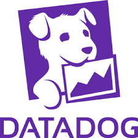

  

  

---

<h1 style="color:#FF5722; text-align:center; margin-top:20px; font-weight:bold;">
  Airowire Observability & FinOps Enablement
</h1>

Enterprise-grade documentation for:
- Cloud Monitoring
- APM & Distributed Tracing
- FinOps & Cost Optimization
- Kubernetes Visibility
- SRE Operational Practices

Powered by <strong>Datadog</strong>.

---

<h2 style="color:#FF5722; font-weight:bold;">Platform Categories</h2>

| Category | Description | Link |
|---|---|---|
| **Azure** | Logs, APM, DSM, Cost | Explore |
| **AWS** | Logs, APM, Tracing, Cost | Explore |
| **GCP** | Logs, Metrics, Cost | Explore |
| **Kubernetes** | K8s Observability + Tracing | Explore |
| **FinOps** | Cost Governance & Usage | Explore |
| **Observability** | DB Monitoring & Alerts | Explore |
| **SRE Practices** | Runbooks + Operational SOPs | Explore |

---

<h2 style="color:#FF5722; font-weight:bold;">Capabilities Breakdown</h2>

<h3 style="color:#8E43E7; font-weight:bold;">Observability</h3>

- Logs  
- Metrics  
- APM  
- Tracing  
- DB Monitoring  
- Dashboards & Alerts  
- Synthetic Monitoring  

<h3 style="color:#FFC100; font-weight:bold;">FinOps</h3>

- Cost Visibility  
- Usage Insights  
- Allocation & Tagging  
- Optimization & Governance  

<h3 style="color:#0059D6; font-weight:bold;">Kubernetes</h3>

- Cluster + Node + Pod Health  
- Auto-discovery  
- Tracing & Logs Integration  

<h3 style="color:#00A57B; font-weight:bold;">SRE</h3>

- Incident Playbooks  
- Operational Runbooks  
- Reliability Practices  

---

> <em>CONFIDENTIAL — FOR INTERNAL AIROWIRE CLIENTS ONLY</em>

